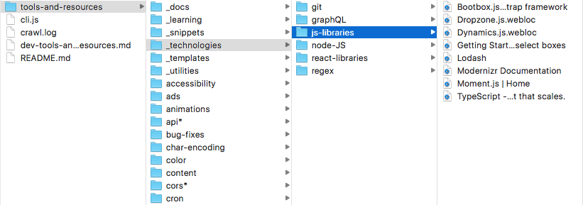

# Bookmark Resource Generator

Bookmark Resource Generator is a CLI utility to parse webloc and browser-printed pdf files of the MacOS folder system into a comprehensive list of links in Markdown.  
--> Find here an [Example generated resource file](./output/dev-tools-and-resources.md)



## Installation

## Usage

```
Usage: cli.js <output-file> <directory-path> [options]

Commands:
  cli.js <output-file> <directory-path>     Define the output file name and the
  [options]                                 directory to crawl

Options:
  --version          Show version number                               [boolean]
  --depth, -d        Max sub-directory depth to search                 [number]
  --ignore, -i       Ignore folders in your parent directory           [array]
  --description, -t  Describe the resource you are generating          [string]
  --help             Show help                                         [boolean]

Examples:
  cli.js tools-and-resources /Users/myusername/Development/tools-and-resources -d 5 -i 'snippets' 'my-dev-project'
```

The generator will print folder names if folder contains subfolders but no link. might lead to printing empty sections.

## Supported file formats

## Improvements

### 1. Code refractor

- draw shema of the program's logic

### 2. Features

- find how to generate resource from chrome/firefox favorites

### 3. Documentation

- Write README.md: installation, usage, supported file types, etc.
- list of unhhandled filepaths

### 4. File rendering

- write title of folder with path to it
- print tabs for each sub level
- order links by alphabetical order? find why capital letters come first..?

### 5. Error handling

- test yargs errors
- for no path provided to command
- find possible errors in file path handling

### 6. Make program a CLI npm package to install globally

- change index.js to cli.js + run \$ chmod +x cli.js + npm link
- fill out package.json https://docs.npmjs.com/files/package.json#bin

## Publishing

- generate .md on github
- update every X
- host with now

## Bugs

issue with calling predefined npm scripts:  
https://docs.npmjs.com/cli/run-script  
need to use `npm run gen --`
